# Learn PostgreSQL 

>  A lightweight documentation of PostgreSQL for beginners.

## Table of Contents

- [Learn PostgreSQL](#learn-postgresql)
  * [Table of Contents](#table-of-contents)
    + [Preface](#preface)
      - [What is a Database?](#what-is-a-database-)
      - [What is SQL and Relational Database?](#what-is-sql-and-relational-database-)
      - [What is PostgreSQL?](#what-is-postgresql-)
    + [Getting Started](#getting-started)
      - [Setup & Install PostgreSQL](#setup---install-postgresql)
      - [PostgreSQL Roles and User Login](#postgresql-roles-and-user-login)
        * [Accessing with Switching Accounts](#accessing-with-switching-accounts)
        * [Accessing without Switching Accounts](#accessing-without-switching-accounts)
        * [How to check Roles in PostgreSQL](#how-to-check-roles-in-postgresql)
        * [Create roles in PostgreSQL](#create-roles-in-postgresql)
        * [Update and Delete a Role in PostgreSQL](#update-and-delete-a-role-in-postgresql)
        * [Create and Delete Roles from using shell commands (Without connecting `psql`)](#create-and-delete-roles-from-using-shell-commands--without-connecting--psql--)
      - [How to create database](#how-to-create-database)
      - [How to connect a database](#how-to-connect-a-database)
    + [The SQL Language](#the-sql-language)
      - [Creating a new table to a database](#creating-a-new-table-to-a-database)
      - [Deleting a table from a database](#deleting-a-table-from-a-database)
      - [Adding data to the table](#adding-data-to-the-table)
      - [Querying data from the table](#querying-data-from-the-table)
      - [Creating a Table With Constraints](#creating-a-table-with-constraints)
      - [Creating a table and Inserting Into that table from a SQL file](#creating-a-table-and-inserting-into-that-table-from-a-sql-file)
      - [Sort Data by Using 'Order BY'](#sort-data-by-using--order-by-)
      - [Uses of WHERE Clause, AND and OR in PostgreSQL](#uses-of-where-clause--and-and-or-in-postgresql)
      - [Using Comparison Operators in PostgreSQL](#using-comparison-operators-in-postgresql)
      - [Using LIMIT, OFFSET & FETCH keywords](#using-limit--offset---fetch-keywords)
      - [Using of `IN` Keyword](#using-of--in--keyword)
      - [Using of `BETWEEN` Keyword](#using-of--between--keyword)
      - [Using of `LIKE` and `ILIKE` operators](#using-of--like--and--ilike--operators)

### Preface

Here we will be introduced with PostgreSQL an open-source, robust, high-performance database with a lot of great features where we will do some hands-on practice to learn the basics of PostgreSQL. All the implementations were tested on Ubuntu 18.04. Before diving into PostgreSQL, we will have a look at some basic theory of **database**, **SQL**, and **PostgreSQL**.

#### What is a Database? 

The **database** is an organized collection of structured data that is used to store, manipulate, and retrieve data.

#### What is SQL and Relational Database? 

A **relational database** is a type of database that stores access to data points that are related to one another.

**SQL** (Structured Query Language) is a domain-specific language in programming that can manipulate a relational database.

#### What is PostgreSQL?

**PostgreSQL** also known as '**Postgres**' is an open-source, robust, high-performance object-relational database system that extends the SQL language with a lot of great features that safely store and scale the most complicated data workloads.


### Getting Started

#### Setup & Install PostgreSQL 

Just follow this link [Linux downloads (Ubuntu)](https://www.postgresql.org/download/linux/ubuntu/) and copy the script then paste on your terminal to install on Ubuntu using the apt repository. 

For other systems follow this official link [Downloads](https://www.postgresql.org/download/) to download and for installation instructions.

#### PostgreSQL Roles and User Login

PostgreSQL role is a feature by PostgreSQL for handling authentication and authorization. It's a concept of managing permissions where more than one roles can be created and roles can be members of other roles, allowing them to take on the permission to manipulate changes.

##### Accessing with Switching Accounts

After installation by default PostgreSQL created an account called  *postgres*  that is the default PostgreSQL Role. To log in this account, switch over to the *postgres* type this command:

`$ sudo -i -u postgres`

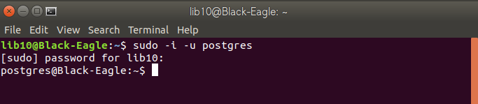

To access a Postgres prompt type:

`$ psql`

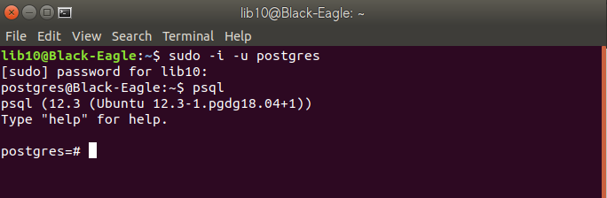

Now you will be logged in and able to start the interaction with the database.

To quit from Postgres prompt just type this command:

`postgres=#  \q`

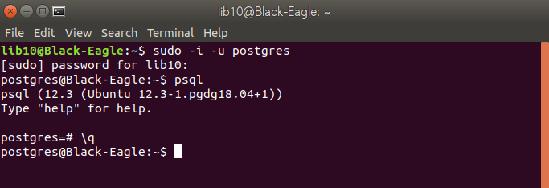

##### Accessing without Switching Accounts

Following is the command that will log into Postgres without the intermediary *bash* shell in between.:

`$ sudo -u postgres psql`

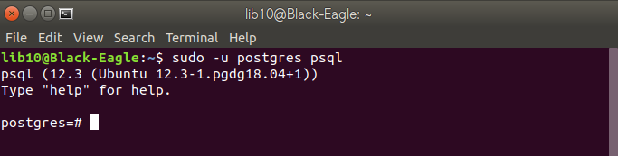

##### How to check Roles in PostgreSQL 

To check the list of roles first type the following command:

`psql`

then type this:

`\du` 

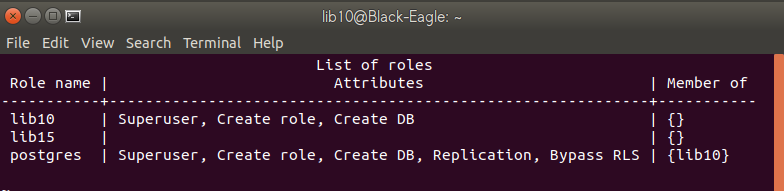

We will see the list of roles with their name,  list of attributes, and member of which role.

##### Create roles in PostgreSQL

We noticed that by default there is a role named `postgres`. We can also create a new roll 

from the Postgres prompt.

First, enter into the prompt by typing `psql` if you are not already in. 

Then we can create a role simply typing this:

`CREATE ROLE new_roll_name;`

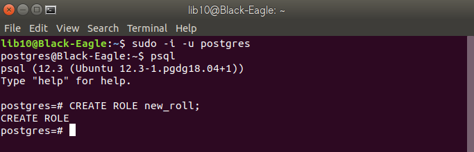

And we can add a password for the login session and add attributes that will define which types of access the role has been authorized to manipulate into the database. Then we can also add to the column 'member of' if the role is under any member.

Let's add a role where the user name is `SubAdmin`with  authorized as `SUPERUSER`,  `CREATEDB`attributes and `PASSWORD`is 'abcd':

`CREATE ROLE SubAdmin WITH SUPERUSER CREATEDB PASSWORD 'abcd'; `

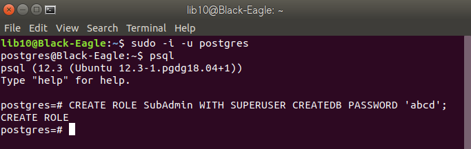

Type `\du` to see the newly created role.

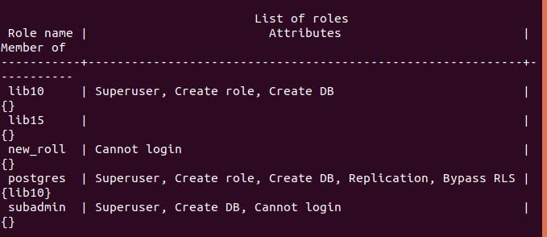

##### Update and Delete a Role in PostgreSQL

Suppose we need to add more attributes to our new role `lib10` and that means we need to update the role attributes change the password. 

To update attributes to the new role and change it's password type the command:

`ALTER USER WITH SUPERUSER CREATEDB CREATEROLE LOGIN ENCRYPTED PASSWORD 'Newabcd';`

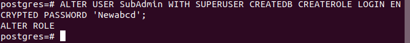

If we need to delete a role than simply type:

`DROP ROLE SubAdmin;`

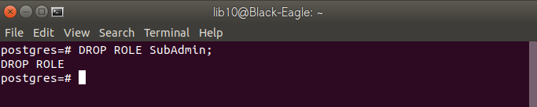

##### Create and Delete Roles from using shell commands (Without connecting `psql`)

To create a database role with non-superuser access from the shell just type and enter:

`createuser -PE RoleName`

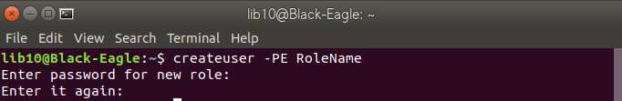

Where our `-P` flag prompts to set a password for the new role and the `-E`flag indicates to store the password as an MD5-encrypted string.

We can check the role created by connecting to `psql`and running `\du` command.

To Delete a database role from the shell just type:

`dropuser -i RoleName`


To create a superuser from the shell type:

`createuser -sPE SuperuserName`

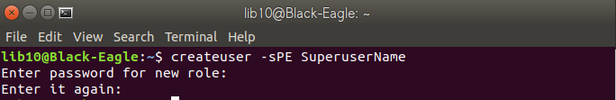

#### How to create database

There are two ways to create a database. 

To create a database from shell type:

`$ createdb databaseName1`

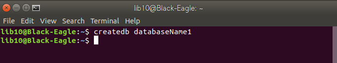

To create a database from `psql`type:

`CREATE DATABASE databaseName2;`

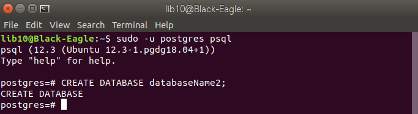

To see the list of databases and  their details type from `psql`:

`\l`

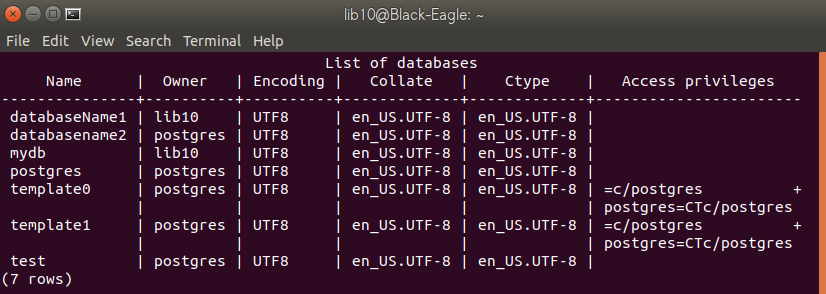

To delete a database from the shell type:

`$ dropdb databaseName1`

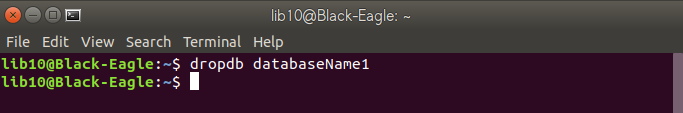

And to delete the database from the `psql`type this:

`DROP DATABASE databaseName2;`

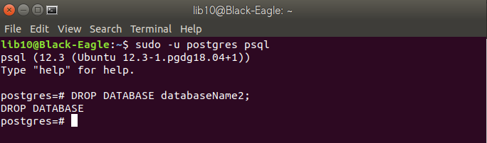

#### How to connect a database

To connect a database type from the shell:

`psql databasename;`

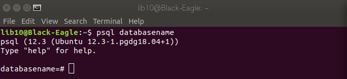

To switch from another database type:

`\c databasename2`

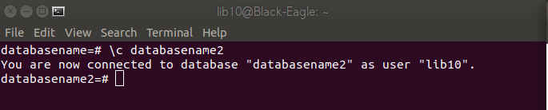

To get help for various SQL commands type:

`\h`

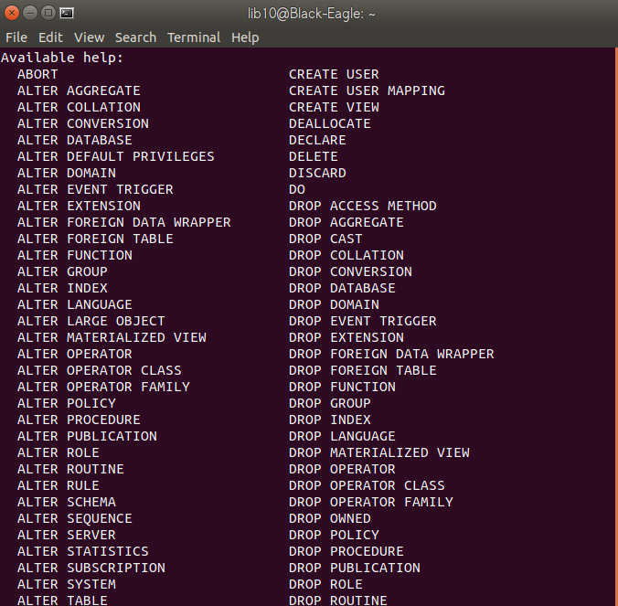

To quit from the database type:

`\q`

### The SQL Language 

To store, retrieve, and manipulate database PostgreSQL uses the basic SQL language. Let's see some examples.

#### Creating a new table to a database

In SQL to create a table, we need to define the table name, column name, and their data types.

To create a table type copy this:

```
CREATE TABLE weather (
    city            varchar(80),
    temp_lo         int,           -- low temperature
    temp_hi         int,           -- high temperature
    prcp            real,          -- precipitation
    date            date
);
```

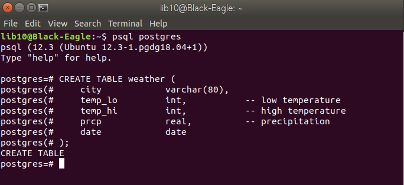

Here we can see a table named weather where 5 columns and their data types added. Here in the first column `city` is a column and `varchar` is its types with a range of 80 characters.  We can add a comment to start with`--` and we can see three comments here.

 Another example:

```
CREATE TABLE cities (
    name            varchar(80),
    location        point
);
```

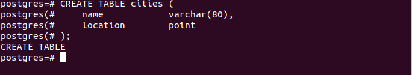

The `point` type is an example of a PostgreSQL specific data type.

#### Deleting a table from a database

To delete a database type this:

```
DROP TABLE tablename;
```

#### Adding data to the table

To add or insert data into a table type this example:

```
INSERT INTO weather VALUES ('San Francisco', 46, 50, 0.25, '1994-11-27');
```

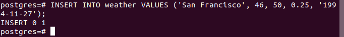

Here we can see the table name should be specified with its columns value.

Another example:

```
INSERT INTO cities VALUES ('San Francisco', '(-194.0, 53.0)');
```

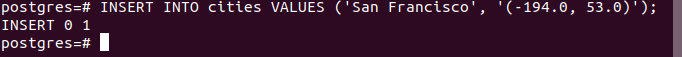

We saw a type PostgreSQL specific data type `point` above example shows that we the of `point` type should be defined as coordinate pairs.

An alternative way to insert data to avoid remembering the column name:

```
INSERT INTO weather (city, temp_lo, temp_hi, prcp, date)
    VALUES ('San Francisco', 43, 57, 0.0, '1994-11-29');
```


The column name can be listed in a different order.

```
INSERT INTO weather (date, city, temp_hi, temp_lo)
    VALUES ('1994-11-29', 'Hayward', 54, 37);
```


An additional feature and optimized way to insert a large number of data just type `COPY`command with the table name and its location where the database exists.

```
COPY weather FROM '/location/fileName.txt';
```

#### Querying data from the table

To retrieve data from a table type this:

```
SELECT * FROM weather;
```

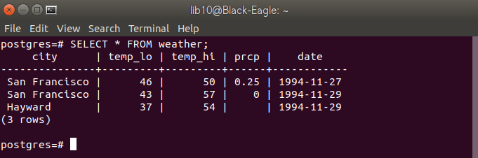

We can write expressions, not just simple column references, in the select list. For example, we can do:

```
SELECT city, (temp_hi+temp_lo)/2 AS temp_avg, date FROM weather;
```

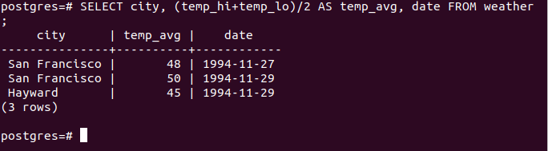

#### Creating a Table With Constraints

We can specify some constraints to a table where the constraints need to be satisfied to insert data into the table.

Let's create a table with some constraints where all column has a constraint `NOT NULL` except `email`column. Type this:  

	CREATE TABLE person1 (
		id BIGSERIAL NOT NULL PRIMARY KEY,
		first_name VARCHAR(50) NOT NULL,
		last_name VARCHAR(50) NOT NULL,
		email VARCHAR(50),
		gender VARCHAR(5) NOT NULL,
		data_of_birth DATE NOT NULL
	);

The constraint `NOT NULL`specifies that the column must have a data, it can not be left as blank.

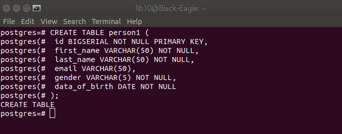

Let's check and see the description of the table by typing:

`\d person`

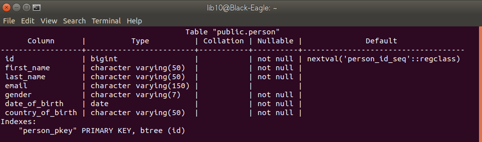 			

#### Creating a table and Inserting Into that table from a SQL file

Let's assume that we have a SQL file where we have a table named `person` and it's column values in a location named `/home/lib10/Downloads/person.sql`. Now, we need to run that file from PostgreSQL prompt, then type:

`\i /home/lib10/Downloads/person.sql`

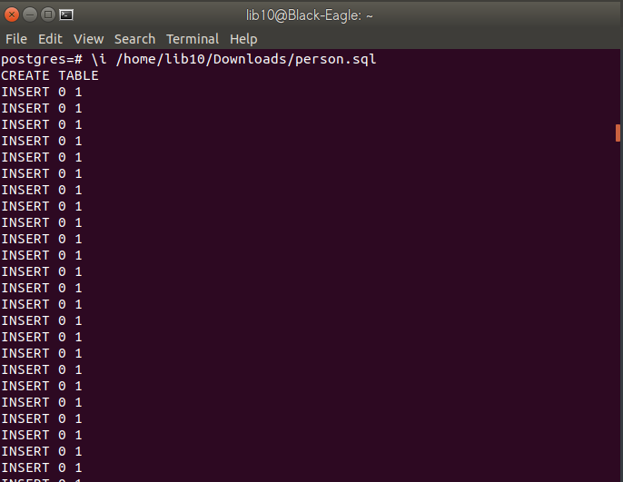

To retrieve all data from the table type:

`SELECT * FROM person;`

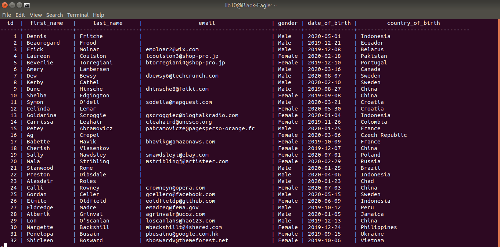

#### Sort Data by Using 'Order BY'

In SQL we can retrieve sorted data of a table by using `ORDER BY` command. Let's try to retrieve the sorted data by ascending order from our previous table by their country_of_birth. Type the following SQL Command.

`SELECT * FROM person ORDER BY country_of_birth ASC;`

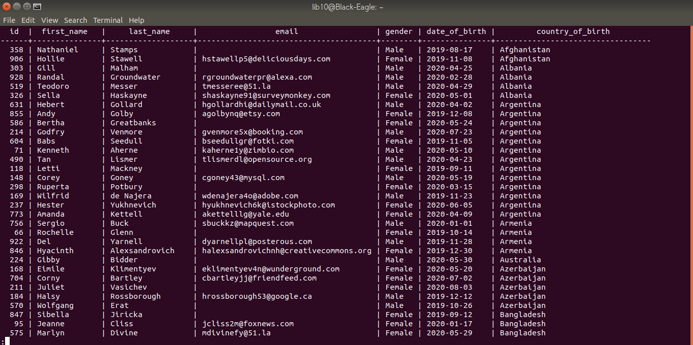

Notice above the table where the `country_of_birth` is sorted by Ascending Order.

To sort the column by descending order type:

`SELECT * FROM person ORDER BY country_of_birth DESC;` 

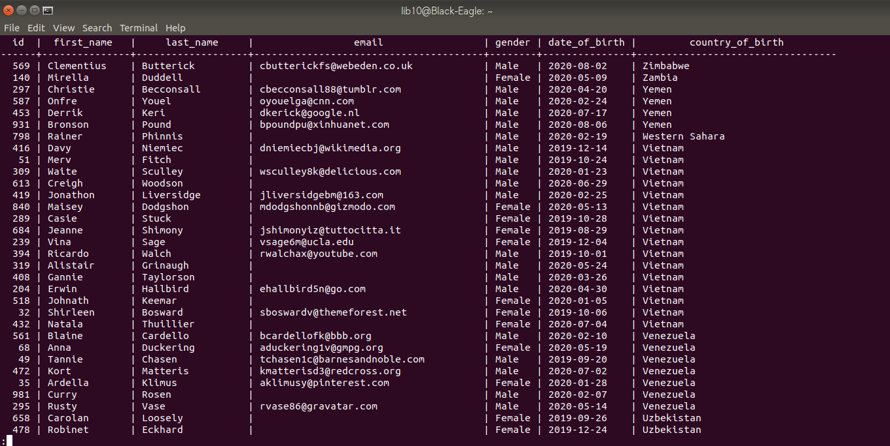

Now, notice above the table where the `country_of_birth` is sorted by Descending Order.

Like these, we can sort the table by the rest of the column names. (`id, first_name, last_name, email, date_of_birth`)

Now, Let's sort the table by multiple column names.  Type this:

`SELECT * FROM person ORDER BY first_name, email;` 

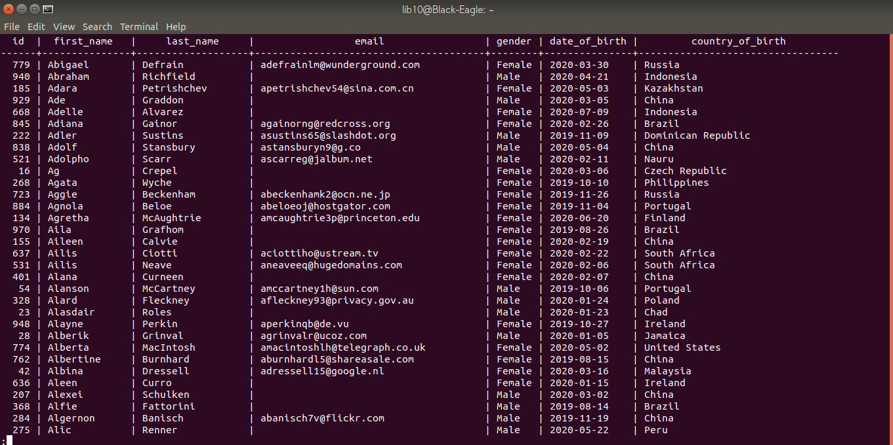

The output of the command is showing that `first_name` and `email` columns are sorted in Ascending Order.

Taking only one column and sort that column in Ascending Order type:

`SELECT last_name FROM person ORDER BY last_name ASC;`

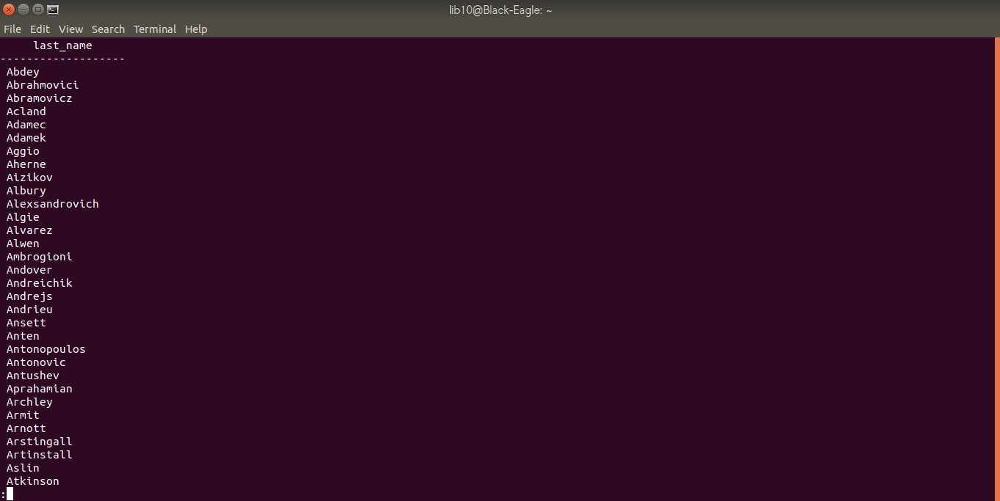


To retrieve unique data of a column we will use `DISTINCT` command.

Let's assume that we need to retrieve the unique `country_of_birth` which are appeared only once on the table `person` let's type:

`SELECT DISTINCT first_name  FROM person ORDER BY first_name;`

Following image is showing the output:

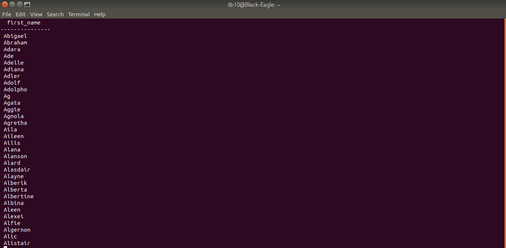

#### Uses of WHERE Clause, AND and OR in PostgreSQL

To retrieve data of a specific group such as `gender = Female` from the table `person` type this:

`SELECT * FROM person WHERE gender = 'Female';`

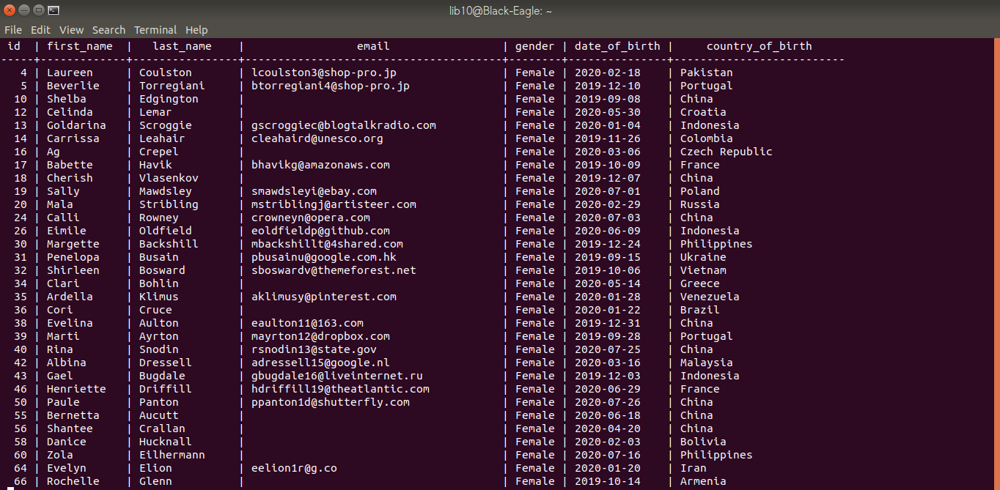

We can use multiple conditions in WHERE clause using `AND` conditional operator.

Let's retrieve data of male gender from country Poland, type:

`SELECT * FROM person WHERE gender = 'Male' AND country_of_birth = 'Poland';`

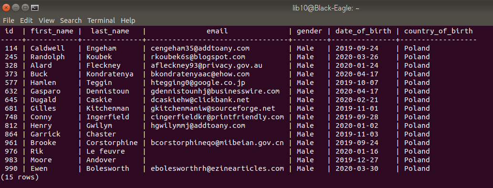

Now, we will use the OR condition to retrieve data from more than one country. For showing male gender from Poland and Bangladesh type this:

`SELECT * FROM person WHERE gender = 'Male' AND country_of_birth = 'Poland' OR country_of_birth = 'Bangladesh';`

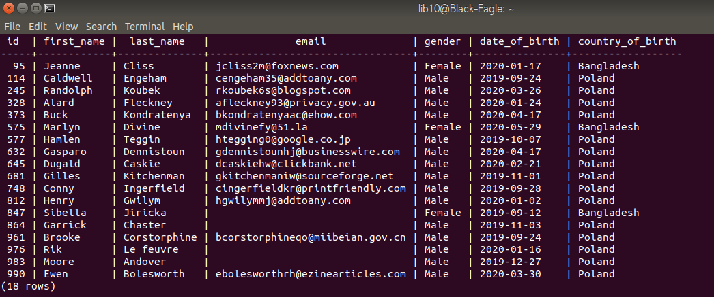


#### Using Comparison Operators in PostgreSQL

In SQL this is allowed to use some types of operations and they are:

- Arithmetic Operations
- Comparison Operations
- Bitwise Operations
- Logical Operations

Following are some comparison operations performing on `psql` :

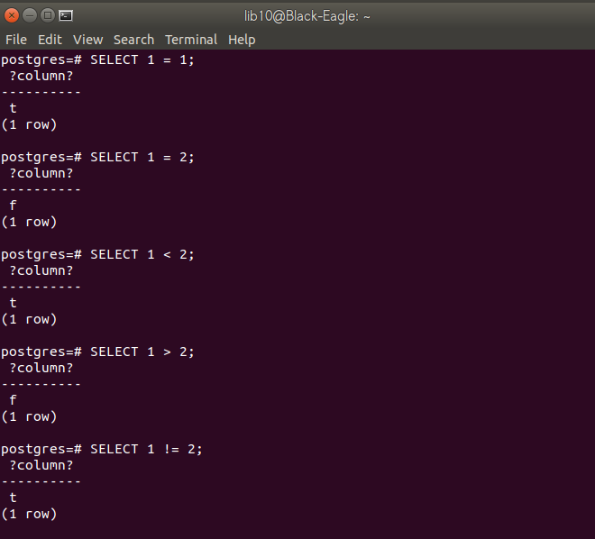

We can also perform these operations on other data types. Let's see how to perform on string:

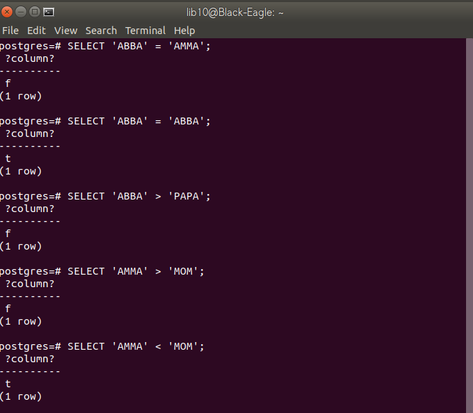


#### Using LIMIT, OFFSET & FETCH keywords

`LIMIT` is used to retrieve specific numbers of data from data. Let's assume that we want to see only the first 10 rows from the `person` table, then type this:

`SELECT * FROM person LIMIT 10;`

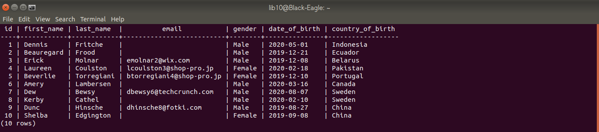

`OFFSET` keyword is used when we need to skip a certain amount of data and start from where want to see.

Let's assume that, we want to retrieve and show 10 rows of data skipping the first 5 rows from the table, then type this:

`SELECT * FROM person OFFSET 5 LIMIT 10;`

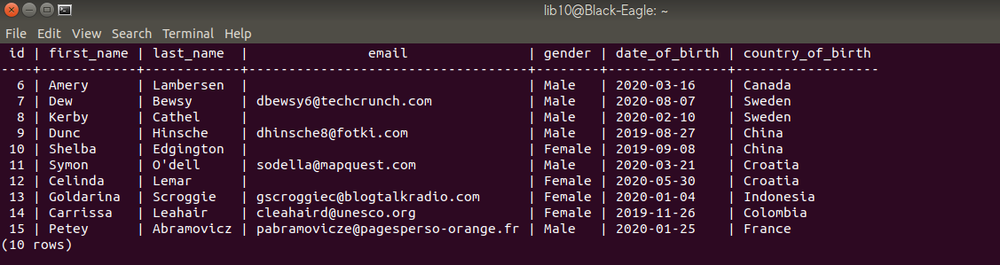

Here above image, you can see the `id` column started from `6` and showing only 10 rows till `id` is `15`. 

`FETCH` keyword allows the same thing as `LIMIT` but `LIMIT` is not a standard SQL keyword where `FETCH` is an actual standard keyword in SQL.

Let's see an example, type this:

`SELECT * FROM person OFFSET 5 FETCH FIRST 5 ROW ONLY;`

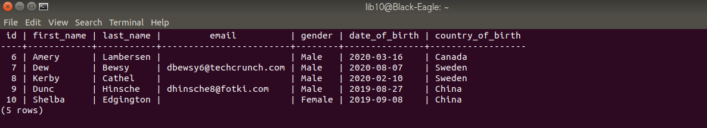 

#### Using of `IN` Keyword

This keyword is used for showing specific data related to specific values.

Let's assume that we want to show data only from `country_of_birth` Poland, Brazil, France, then type this:

`SELECT * FROM person WHERE country_of_birth IN ('Poland', 'Brazil', 'France');`

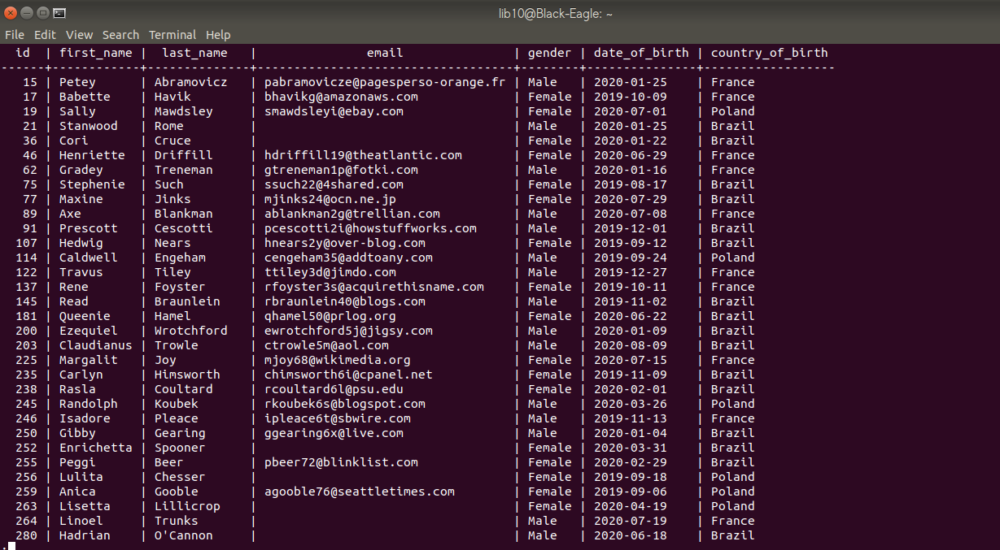

#### Using of `BETWEEN` Keyword

This keyword is used to select data from a range. To find persons in a specific range of `date_of_birth` type:

 `SELECT * FROM person WHERE date_of_birth BETWEEN DATE '2019-01-01' AND '2019-10-01';`

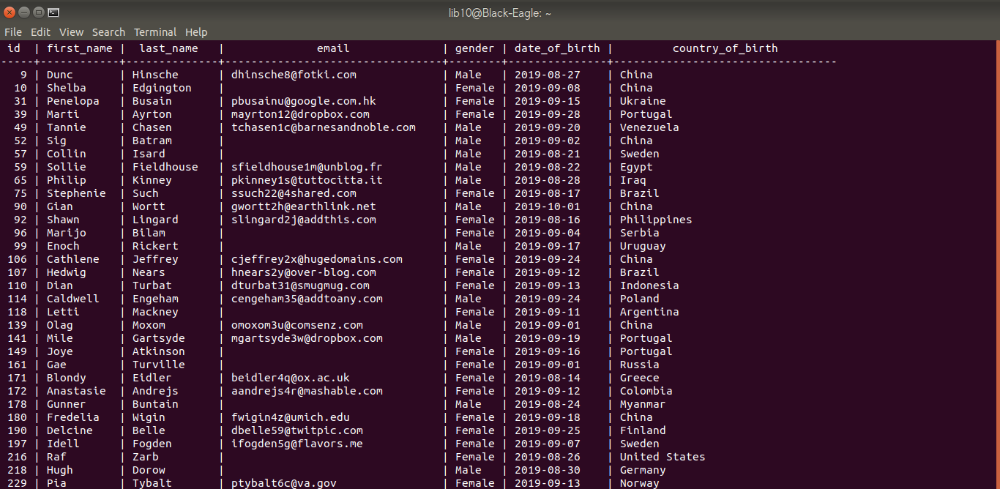

#### Using of `LIKE` and `ILIKE` operators

Let's retrieve data using `LIKE` of email addresses of `.org` the domain from `email`, type this:

`SELECT * FROM person WHERE email LIKE '%.org';`

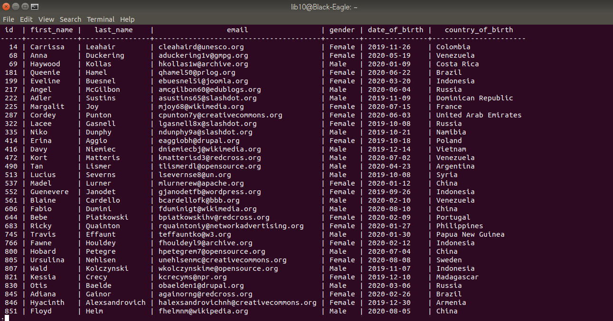

We can specify at least how many characters will appear before `.org` 

For example, we want only those email addresses which have at least 17 characters long before`.org` then we need to add 17 numbers of '_' (dash) before the `.org` domain by typing like this:

`SELECT * FROM person WHERE email LIKE '%_________________.org'; `

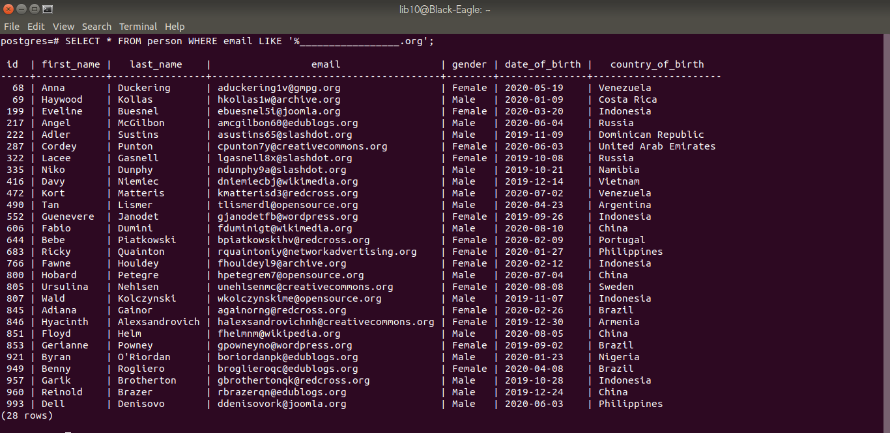


`ILIKE` is used to ignore the case sensitive issues. Such as, we will type same SQL command replacing `LIKE` with `ILIKE` exactly before we used where we will type `.org` as a capital case `.ORG` and it will show the exact same output.   

`SELECT * FROM person WHERE email ILIKE '%_________________.ORG';`

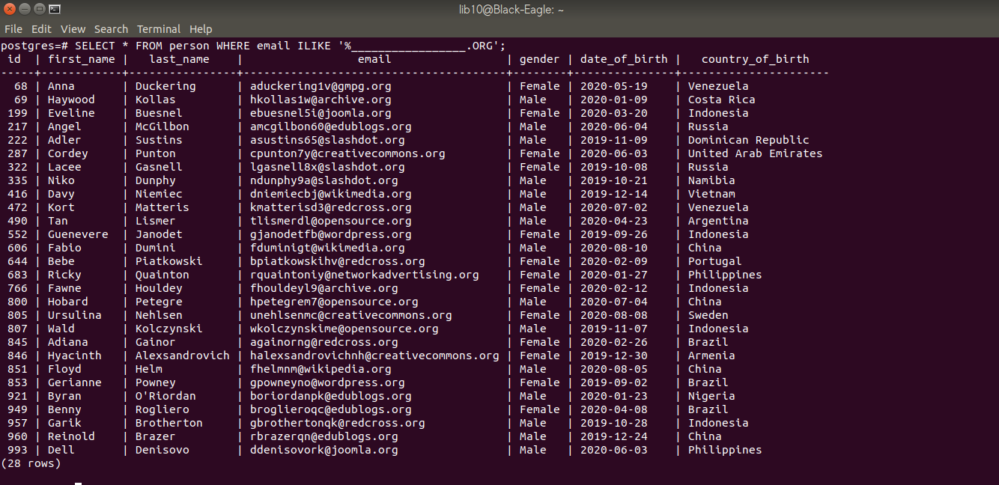


#### To be continued ...